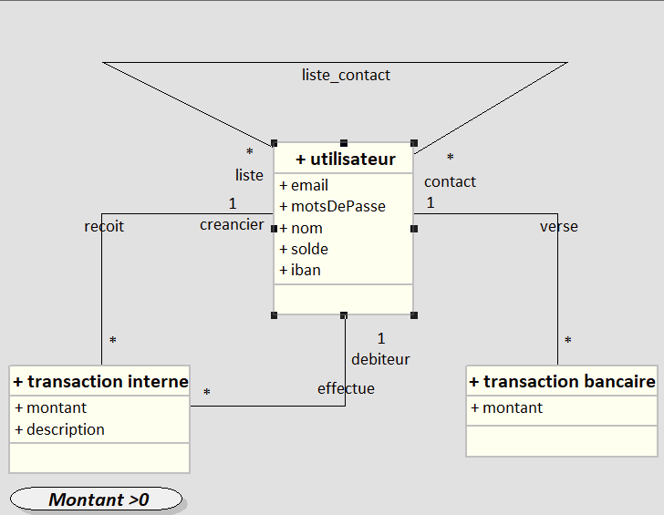

# PayMyBuddy

## Le diagramme de classe UML

## Le modèle physique de données

## Les scripts SQL de base de données
[Script SQL](Script DB/Script SQL.sql)
[Script Data Test](Script DB/Script Data Test.sql)